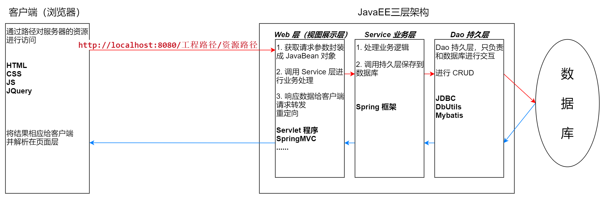
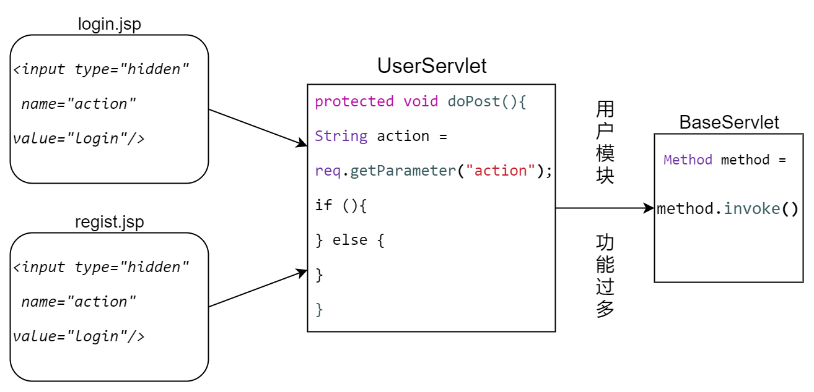

# 书城管理系统

## 创建环境

IDEA + JDK + Tomcat + MySQL + JDBC

### jar 包

jar 包统一在 [Maven Repository](https://mvnrepository.com/) 进行下载，**更推荐使用 Maven**

* mysql-connector-java-8.0.25
* druid-1.2.6
* [单元测试支持包]
* servlet-api
* commons-dbutils-1.7
* commons-beanutils-1.9.4
* commons-logging-1.2（使用 BeanUtils 时必须导入）

## 运用技术

H5+C3+JS+JQuery、Servlet、Cookie&Session、Filter、XML&JSON、Ajax

## 项目介绍

**！没有应用到框架**

使用基础 JavaWeb 技术实现的一个简单但功能完善的书城管理系统，算是对技术的一个融合，用来入门我感觉还是不错

### 界面功能

......

------

## 更新记录

### 首次更新

1. 创建考虑到的所有静态页面，作为后续技术添加的一个基础承载，目前使用到的技术为 H5+C3+JS+JQuery
2. 根据模拟一个用户的使用过程进行编写，首先对注册页面进行一个表单验证
    1. 对用户名和密码进行格式（字母、数字和下划线组成）与长度（5-12位）的限制，具体使用正则表达式 `/^\w{5,12}$/`
    2. 对邮箱进行格式的验证，格式为 `xxxxx@xxx.com`，正则表达式为 `/^[a-z\d]+(\.[a-z\d]+)*@([\da-z](-[\da-z])?)+(\.{1,2}[a-z]+)+$/`
    3. 因为只是静态页面，这里的验证码判断有内容输入即可
3. 登陆成功跳转到 regist_success.html 页面

### 第二次更新



1. 完善项目结构：根据三层架构对将要编写的业务代码进行解耦，方便后期维护和扩展升级
    * **web 层**
    * **service.impl 层**
    * **dao.impl 层**
    * **pojo 层**
    * test 测试包
    * utils 工具类
2. 创建数据库和所需要的表
   ```sql
      drop database if exists book;
      
      create database book;
      
      use book;
      
      create table t_user(
          `id` int primary key auto_increment,
          `username` varchar(20) not null unique,
          `password` varchar(32) not null,
          `email` varchar(200)
      );
      
      insert into t_user(`username`,`password`,`email`) values('aidan','aidan','aidan@aidan.com');
      
      select * from t_user;
   ```
3. 编写对应数据库对象的 JavaBean 进行交互
4. 编写 Dao 持久层，为了简化操作统一管理，先编写 JDBCUtils 工具类
    1. 使用阿里的数据库连接池，导入 druid.jar
    2. 将 JDBC 数据写入 jdbc.properties 方便统一修改
    3. 创建 BaseDao 父类对通用的 CRUD 方法进行封装
    4. 完成 UserDao 的实现，用户模块持久层编写完成
5. 使用 UserService 完成登录注册以及检查用户名是否存在
6. 完成 LoginServlet 和 RegistServlet

### 第三次更新

主要是将 html 文件替换为 JSP 文件和优化代码文件，都 MVC 思想了，还在 JSP 里写 Java 确实有点不纯粹

如果 IDEA 对 JSP 没有代码提示或者报错的情况，在依赖中导入 Tomcat Libraries 就好了（一个现在用不到的新技能）

* 将所有公共 html 代码进行整合到 JSP 文件中，使用 `<%@ include file="/pages/common/head.jsp" %>` 来导入，减少冗余
* 将项目路径改成动态获取的形式 `request.getScheme() + "://" + request.getServerName() + ":" + request.getServerPort()`
* 使用设置 request 属性的方式实现错误信息的回显
* 合并 LoginServlet 和 RegistServlet 为 UserServlet
    1. 为每个功能请求页面（Login、Regist）的表单中创建一个隐藏的输入项：`<input type="hidden" name="action" value="login"/>`，用来做方法判断
    2. `String action = req.getParameter("action");`来获取方法，使用反射来调用（if...else不够优雅）
* 编写了 BeanUtils 方便将参数注入对象（应对参数过多的情况）


<br><br><br><br><br><br><br><br><br><br><br><br>

### 第四次更新

编写了图书模块的业务实现，对图书管理界面的显示采用查询数据库的方式来动态生成

**实现方式：** 将管理的跳转改成 BookServlet 下的 list 方法，`<a href="manager/bookServlet?action=page">`

* `href` 默认为 GET 方法，所以在进行方法反射选择的 BaseServlet 中在 doGet() 方法下调用 doPost() 方法，实现相同的功能
* 因为 Tomcat 为最新版，而官方头文件改为了 jakarta，所以在使用 JSTL 时出现 `javax/servlet/jsp/tagext/TagLibraryValidator` 的错误，下载两个新版的 jar 包(
  2.0.0)成功解决了 `jalarta.servlet.jsp.jstl-2.0.0`、`jalarta.servlet.jsp.jstl-api-2.0.0`
* 添加和修改操作使用同一个页面表单进行操作，使用隐藏域的方式进行区分 `<input type="hidden" name="action" value="${ empty param.id ? "add" : "update" }">`
  根据原理：添加的操作中 ID 值是自增的，而更新操作需要使用页面传输参数 ID
    * 使用管理页面中，点击“添加”或“修改”，传递不同的参数
    * 或者直接提交，通过在 Servlet 中判断提交数据是否有 ID 值的方式判断

**分页功能**

* 对分页模型进行构建，实现了页码单击跳转，首[末]页不显示上[下]一页的判断 
* 修改分页后，增加、删除、修改图书信息能够回显页面 
* 对分页条进行封装，使用静态包含的方式来引用，方便统一管理

### 第五次更新

* 对 index.jsp 冲定向至 client/index.jsp 这样即使为了进行分页请求，同时为后续权限隔离做准备 
* 完成 index.jsp 展示的分页处理 
* 对 index.jsp 添加按价格区间查询的功能（封装于图书模块中），同时添加了查询价格回显的功能 
* 遇到 BUG: 在价格查询后的分页中，进行页码跳转会导致跳出价格查询功能 
* 解决方式：使用 StringBuilder 将价格区间添加到 url


### 第六次更新

* 登录动态显示用户名 
* 主页判断是否有用户登录，动态显示欢迎信息

**表单重复提交问题：**

1. 服务端未能及时响应结果（网络延迟，并发排队等因素），导致前端页面没有及时刷新，用户有机会多次提交表单
2. 提交表单成功之后用户再次点击刷新按钮导致表单重复提交
3. 提交表单成功之后点击后退按钮回退到表单页面再次提交

可以使用使用前端变量进行判断，提交一次脚本变量的值设置为 `true` 重复提交进行提醒，这是我一开始的想法，但既然注册页面有验证码，直接用验证码进行控制即可

**使用验证码：** 获取验证码的 Session 值，然后移除 Session ，这样验证码刷新，即便用户重复提交注册表单，Session 中也没有内容，在重复判断时自然也不会通过

这里的验证码使用的是谷歌的 Kaptcha-2.3.2 ，在 2015 年就不再更新了，对 Servlet 接口（10.0 之后的版本）的调用也还停留在 `com.javax...` ，我这边是直接下载了源码，对调用部分进行了修改，然后重新编译封装（完全能用）


**购物车模块：**

购物车随着用户的不同实时变化，这里采用最简单的 Session 做法，即：将给加入购物车按钮添加事件，将要添加的对象属性放到 Session 中，然后在页面中遍历显示，CRUD 等操作直接封装在 Bean 中


### 第七次更新

**订单模块：**

* 添加购物车界面的订单下单功能，可以在数据库和订单界面查看已下单的订单信息 
* 实现 Filter 过滤功能，对 URL 访问进行一定量的拦截（登录获得访问权限）
* 对下单功能增加了事务管理，使用 ThreadLocal + Filter 后置代码的方式实现，防止出现下单未完成，数据却局部保存的情况
  * 改变 JdbcUtils 的方法后，对使用该方法的 Dao 类进行修改
  * 业务实现过程为：Filter -> Servlet -> Service -> Dao -> DataBase，所以除过滤器之外的类应把可能出现的所有错误抛出，防止代码执行到一般就回滚
* 使用 Ajax 实现了用户名输入后检测是否存在，加入购物车消息提示刚加入的书名（之前用 Session 实现）


