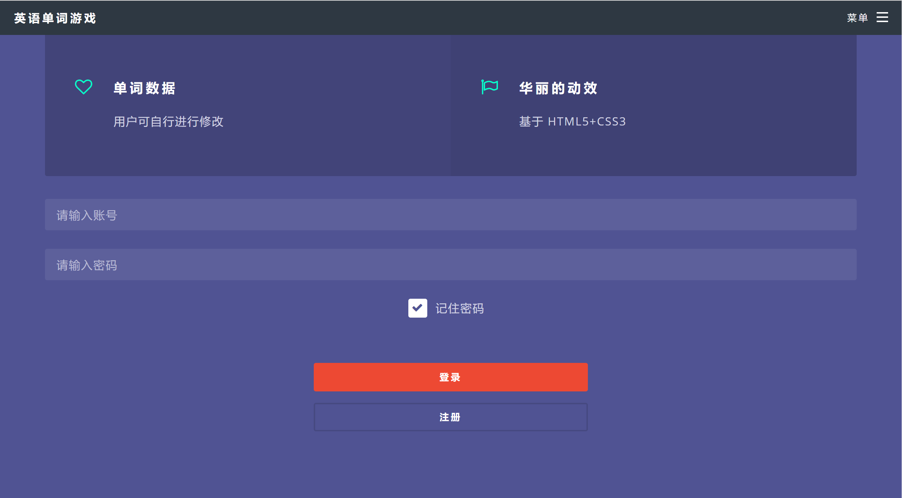
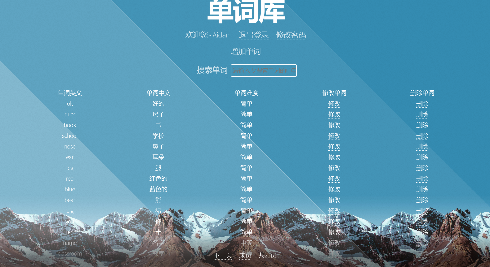
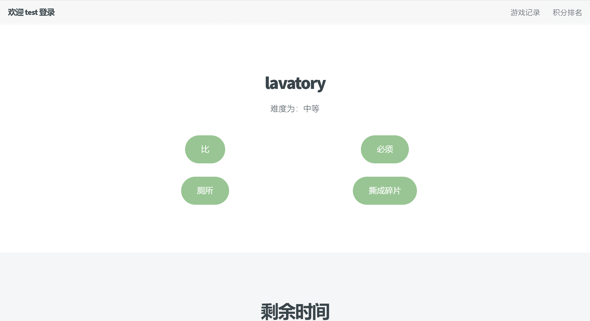
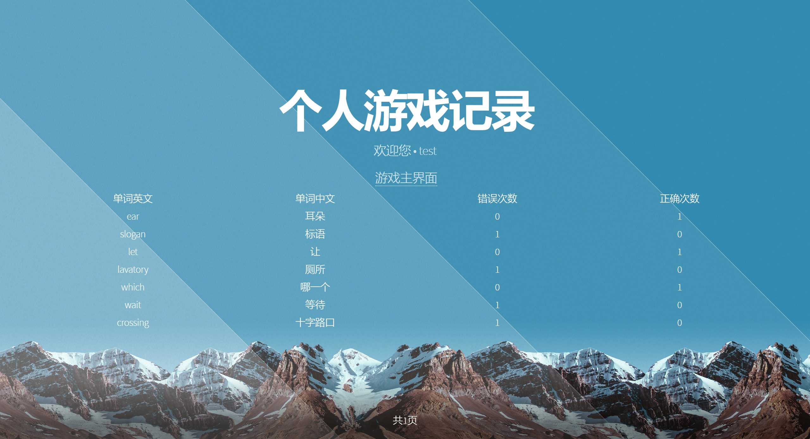
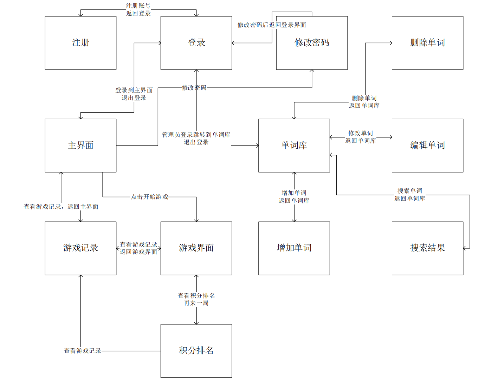

# 界面功能

**登录界面：**

**管理界面：**

**游戏界面界面：**

**排名界面：**

**记录界面：**

# 开发过程

## 模块分析

首先对每个功能模块进行分析，确定后续开发大纲
* 用户管理：登陆用户，修改密码，注册用户，用户排名，用户积分，退出登陆 
* 积分管理：积分累计，积分排名，积分记录
* 单词管理：单词的 CRUD，随机显示，单词和用户关联记录；单词分级，简单，中，难等级
* 主页设计：用户登陆成功之后，进入主页面，使用特效、动画等方式弹出单词，在 5 秒内，选择单词对应的中文词语，提交答案，实时记录得分
  * 选择正确，积分记录，
  * 选择错误，提示警告。进入下一轮

**模块关系走向：**

## 具体实现

1. 点击登录自动跳转锚点到登录的地方。右上角的菜单打开后可以快速跳转到本页面的首页、介绍、登录三部分，使用 Filter 阻止未登录用户访问其他界面。若使用有管理员权限的账号登录，则登陆后跳转到单词库页面
2. 点击注册则跳转到注册页面，该页面用 Ajax 判断用户名是否已经被注册过；只允许注册普通权限的用户
3. 使用 Cookie 实现记住账号和密码
4. 游戏主界面，可以在这里点击修改密码，查看历史游戏记录，退出登录，还可以选择游戏难度
5. 修改密码界面：直接输入新的密码提交后会跳转到登录页面，需要重新登录
6. 在游戏积分排名界面可以查看个人的历史游戏记录，这里记录了本用户曾经所有选择错误或超时的单词；以管理员账号登录后，跳转到单词库的页面。这里可以模糊查询、增加、修改、删除单词
